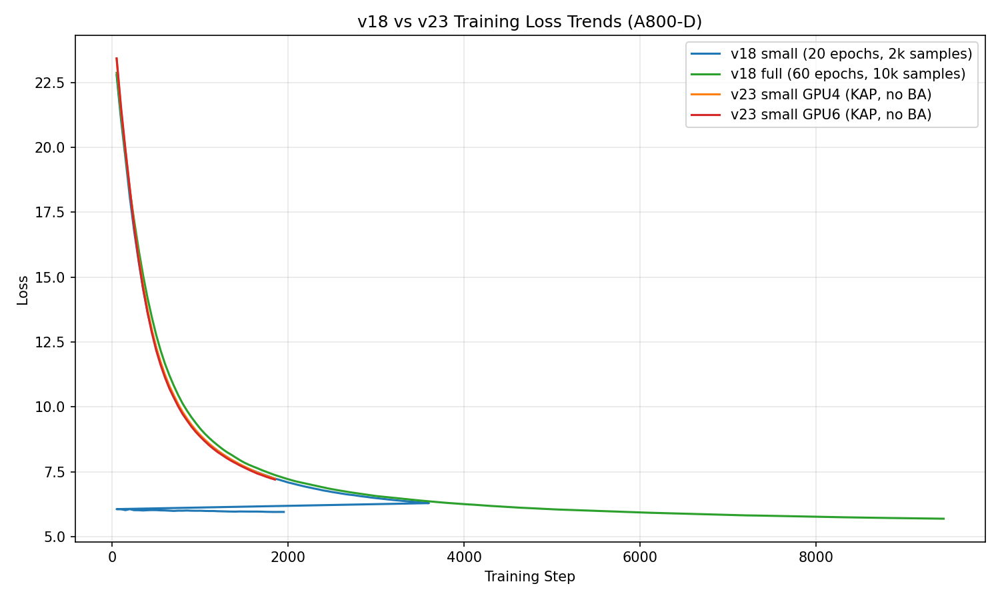

# v23 vs v18 A800 Training Log Comparison

**Date:** 2026-08-08

**Source logs (A800-D, read-only):**
- `outputs/omniview_fusion_v18_deformable_attention.log`
- `outputs/omniview_fusion_v18_deformable_attention_fullscale.log`
- `outputs/v23_kap_no_ba_gpu4.log`
- `outputs/v23_kap_no_ba_gpu6.log`

## 1. Executive Summary

- **v18 full** (GPU5) is the farthest along (~9,450 steps), with loss decaying smoothly to **5.69**.
- **v23 small** (GPU4/GPU6) is still in its first epoch (~1,850 steps) and has not yet produced a `val_MPJPE`.
- **v18 small** completed one epoch and achieved a first-epoch `val_MPJPE` of **20.24 mm**.
- v23 starts from a slightly higher initial loss than v18 (~23.4 vs ~22.8), consistent with the added Kinematic Anthropometric Prior (KAP) term.

## 2. Loss Trend Plot

## 3. Numerical Summary

| Run | Steps | Initial Loss | Latest Loss | Loss @ 1k | Loss @ 1.8k | Val MPJPE |
|-----|-------|--------------|-------------|-----------|-------------|-----------|
| v18_small | 1950 | 22.7839 | 5.9521 | 8.8922 | 7.2969 | 20.24 mm (epoch 1) |
| v18_full | 9450 | 22.8748 | 5.6913 | 9.1643 | 7.4347 | N/A (no val yet) |
| v23_gpu4 | 1850 | 23.4187 | 7.2345 | 8.9169 | 7.2874 | N/A (no val yet) |
| v23_gpu6 | 1850 | 23.4331 | 7.1995 | 8.8518 | 7.2514 | N/A (no val yet) |

## 4. Detailed Observations

### 4.1 v18 (baseline)
- Both v18 small and v18 full begin at ~22.8 and follow nearly identical early trajectories, confirming reproducibility of the deformable cross-view attention baseline.
- v18 small reached the first validation checkpoint at ~3,600 steps with `val_MPJPE=20.24 mm`.
- v18 full is continuing past 9,000 steps without validation yet; the loss curve remains monotonically decreasing with no sign of divergence.

### 4.2 v23 (v18 + KAP, no neural BA)
- Two replicas on GPU4 and GPU6 show almost identical loss curves, indicating deterministic training and stable KAP implementation.
- Absolute loss is higher than v18 at the same step count because the KAP loss (`kap_loss_weight=0.01`) is added to the total objective.
- The rate of loss decay is comparable to v18, suggesting the KAP term is not causing instability or a training stall.
- No validation MPJPE is available yet; the runs are waiting for the first epoch to finish.

## 5. Implications for v23 Full-Scale Launch

- The v23 small runs are behaving as expected and can be considered for promotion to full scale.
- The v18 full run on GPU5 is consuming one A800 device; the next free GPU should be used for the v23 full-scale job.
- Once v23 small reaches its first validation checkpoint, compare its `val_MPJPE` directly to v18 small's 20.24 mm.
- If v23 first-epoch `val_MPJPE` is at or below v18 small's, proceed with the v23 full-scale launch.

## 6. Next Concrete Step

**Monitor GPU5 (v18 full) for completion and launch `scripts/launch_v23_a800_fullscale.sh` on the first free A800 GPU.**

---

*Report generated automatically from A800-D logs. Do not edit A800-D files.*