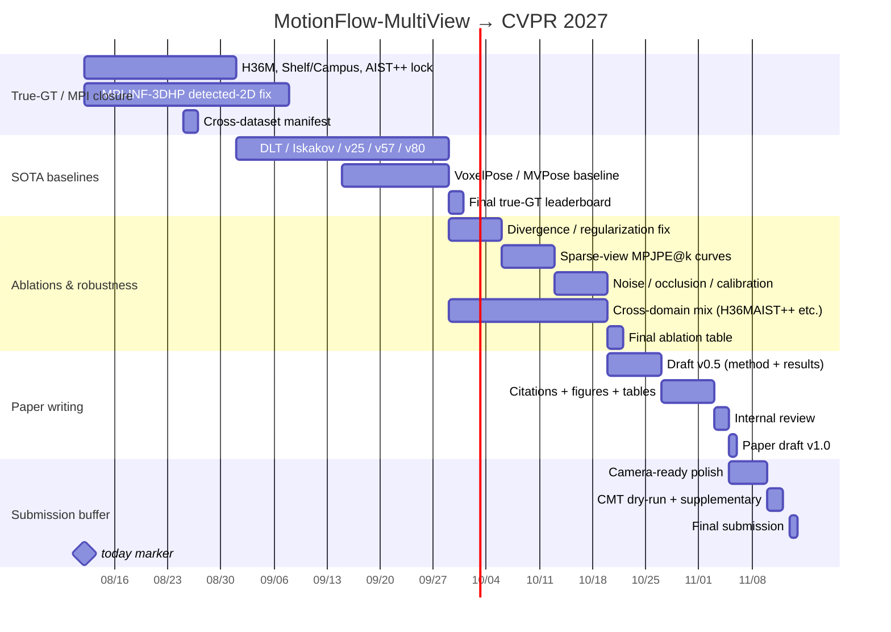

# CVPR 2027 Timeline — MotionFlow-MultiView

> **Project:** MotionFlow-MultiView (sparse-view / cross-domain robust multi-view 3D pose)  
> **Current date:** 2026-08-12  
> **Submission deadline:** 2026-11-13 (Friday; estimated mid-November deadline)  
> **Time remaining:** ~93 days / ~13 weeks  
> **Last updated:** 2026-08-12  

---

## 1. Schedule at a glance

---

## 2. Phase details

### Phase 1 — True-GT / MPI closure (2026-08-12 → 2026-09-08)

| Sub-task | Dates | Deliverable | Exit criterion |
|----------|-------|-------------|----------------|
| Lock non-circular `.npz` | 08/12–09/01 | `data/h36m_true_gt/`, `data/webbridge/shelf_campus_detected/`, `data/webbridge/aistpp_canonical/` | `direct MJE > 0` and DLT baselines reproducible on every dataset |
| Fix MPI-INF-3DHP real detected-2D | 08/12–09/08 | Corrected `.npz` + aligned cameras | DLT baseline ≤ ~30 mm on MPI before any learned-model run |
| Prepare cross-dataset manifest | 08/25–09/01 | `configs/splits/h36m_aist_shelf_campus_mix.yaml` | Loader can iterate mixed datasets without domain-embedding errors |

**Watch-outs:**
- MPI RTMPose detection is currently running on A800 GPU 7; verify alignment as soon as the 16th `.npz` is ready.
- Old `data/h36m_hf/` and `data/webbridge/h36m*.npz` remain circular — do **not** use for model selection.

### Phase 2 — SOTA baselines (2026-09-01 → 2026-09-29)

| Sub-task | Dates | Deliverable | Exit criterion |
|----------|-------|-------------|----------------|
| Re-run core baselines | 09/01–09/22 | DLT, Iskakov ICCV 2019, v25, v57, v80 on H36M/Shelf/Campus true GT | Stable rank order; numbers logged in `docs/results_true_gt_h36m.md` / `docs/results_true_gt_shelf_campus.md` |
| Add VoxelPose / MVPose | 09/15–09/29 | Wrapper scripts + first numbers | Related-work table no longer empty |
| Cross-dataset training v1 | 09/15–09/29 | H36M + AIST++ mix smoke/medium | At least one mixed training run reports val MPJPE |
| Final leaderboard lock | 09/29–09/30 | Combined H36M / MPI / Shelf / Campus / AIST++ table | All numbers reproducible from named `.pth` checkpoints |

### Phase 3 — Ablations & robustness (2026-09-29 → 2026-10-20)

| Sub-task | Dates | Deliverable | Exit criterion |
|----------|-------|-------------|----------------|
| Divergence / regularization fix | 09/29–10/06 | New regularization recipe or mixed-dataset recipe | v25/v57/v80 no longer diverge after epoch 2 on true GT |
| Sparse-view `MPJPE@k` curves | 10/06–10/13 | `eval_variable_views.py` output for k = 2…4 (H36M) and 2…14 (MPI) | Figure + table ready |
| Noise / occlusion / calibration | 10/13–10/20 | Perturbation matrices + robustness table | Quantified degradation vs. baselines |
| Cross-domain transfer | 09/29–10/20 | H36M↔AIST++, H36MMPI, H36M↔Campus transfer rows | At least one transfer result per axis |

### Phase 4 — Paper writing (2026-10-20 → 2026-11-05)

| Sub-task | Dates | Deliverable | Exit criterion |
|----------|-------|-------------|----------------|
| Draft v0.5 | 10/20–10/27 | Full method + results sections | Internally readable, all placeholders replaced |
| Citations + figures + tables | 10/27–11/03 | Real BibTeX, ≥300 dpi figures, main/ablation tables | `docs/paper_corrected_outline_cvpr2027.md` or equivalent updated |
| Internal review | 11/03–11/05 | Review comments addressed | Paper draft v1.0 frozen |

### Phase 5 — Submission buffer (2026-11-05 → 2026-11-13)

| Sub-task | Dates | Deliverable | Exit criterion |
|----------|-------|-------------|----------------|
| Camera-ready polish | 11/05–11/10 | Final PDF, page limit check, author list | Zero LaTeX/BibTeX errors |
| CMT dry-run + supplementary | 11/10–11/12 | Supplementary PDF / video, checksum, dry upload | Upload succeeds in CMT test environment |
| Final submission | 11/13 | CMT submission + confirmation email | Submission ID received |

---

## 3. Key milestones

| Milestone | Target date | What it unlocks |
|-----------|-------------|-----------------|
| Data foundation locked | 2026-09-01 | First honest leaderboard; no more circular-label experiments |
| SOTA baseline lock | 2026-09-29 | Paper results section can be written |
| Robustness package ready | 2026-10-20 | Sparse-view / cross-domain figures and tables complete |
| Paper v1.0 | 2026-11-05 | Submission content freeze; buffer begins |
| CMT dry-run | 2026-11-10 | Avoid last-minute upload or format issues |
| Submission day | 2026-11-13 | CVPR 2027 submission |

---

## 4. Dependencies and guardrails

- **GPU concurrency:** Local RTX 4090 runs one training task at a time; A800 GPU launches require `nvidia-smi` check and a free GPU.
- **A800 read-only boundary:** `/mnt/nvme0n1p1/zhangzy/projects` and the Docker `motionflow` service are read-only. Only launch jobs in `/mnt/nvme0n1p1/zhangzy/motionflow-multiview-kimiswarm-iter20` when a GPU is free and explicitly approved.
- **Data quality gate:** Do not move learned models onto a dataset until its DLT baseline is ≤ ~30 mm, otherwise the numbers measure label/camera bugs, not pose accuracy.
- **Paper story:** The contribution is sparse-view + cross-domain robustness, not absolute MPJPE records. Every experiment should feed that story.

---

## 5. Related documents

- `docs/cvpr2027_status.md` — day-to-day status
- `docs/roadmap_cvpr2027.md` — strategic roadmap and paper story
- `docs/cvpr2027_submission_checklist.md` — detailed task checklist with owners and statuses
- `docs/open_blockers.md` — current P0/P1 blockers
- `docs/results_true_gt_h36m.md` — H36M true-GT numbers
- `docs/results_true_gt_shelf_campus.md` — Shelf/Campus true-GT numbers
